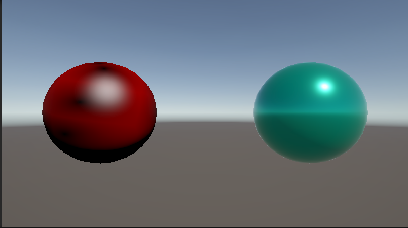

# はじめに
プログラムワークショップⅣの4つ目の管理用です

# 結果画像

## 工夫した点
### MyLitShaderGraph
* Fragmentの一部のパラメータをブラックボードから編集できるようにし、数値を変更した
### MyUnlitShaderGraph
* Blinn-Phongの反射モデルを追加した
* 時間で動くVoronoiNoiseを追加した

# 進め方

- 本リポジトリ(tpu-game-2025/PGWS4_4)をforkしてください。
- fork先のリポジトリを更新してください
- Unityのプロジェクトをsrc内で進めて下さい。
- 結果を画面キャプチャして、画像としてリポジトリに追加して、上記のリンクから見れるようにしてください。
- 完成したら本リポジトリのmainブランチにpull requestを投げてください

